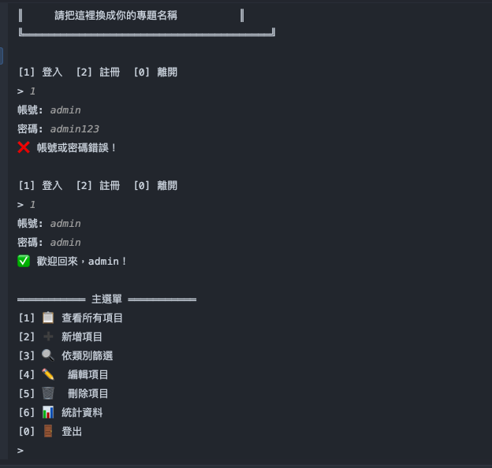

# 📋 個人管家

以 **Java + PostgreSQL** 開發的**可高度自訂**個人生活追蹤系統，專注於彈性打卡、長期管理與有溫度的生命記錄。

使用者可根據自身需求開啟或關閉各項功能模組。

> **適合對象：** 需要長期管理生活方方面面的任何人。

---

## ✨基礎功能：追蹤任務、循環提醒、Last Time  
   - 自訂各種統計項目：習慣、挑戰、目標、學習進度、療癒打卡等。
   - 除了每週、每月固定循環外，也支援專案進度過半、完成第Ｎ次挑戰等非固定排程。
   - 輕鬆查找任務的最後執行時間，自動顯示過去時間或未來倒數。

## ✨特色功能：個人化日記、虛擬管家、遊戲挑戰

   - 支援多種記事類型：子彈筆記、心情日記、孕期紀錄、辭職倒數、頭痛日記等。
   - 可依個人喜好於撰寫時提供星座運勢、媽祖抽籤、領袖名言等心靈鼓勵內容。
   - 「去年的今天」——歷史比較：可查看過去同一天或特定日期的日記，幫助使用者看見自己的成長軌跡。
   - 輔助總結與覆盤：開放匿名資料讓「 AI 管家」進行深度年度分析與生命反思。
   - 模組設計與社群分享：可自行上傳圖片美化介面、客製化模板、匿名留言板等。
   - 重要資料加密儲存：卡號、餘額、借貸紀錄等敏感金融資料採用 AES 加密儲存。
   - 「Let's Play」——獎勵&懲罰遊戲模組，給使用者更有動力達成目標。

---

## 💡 技術要點與亮點

- **Java 17** + **PostgreSQL** + **JDBC**
- **Strategy Pattern**：實現彈性循環規則引擎
- **AES 加密**：重要金融資料（卡號、餘額、借貸）安全儲存
- **模組化設計**：功能可自由開啟/關閉，資料保留在後台
- **分層架構**：Model / DAO / Service / View
- **同一天歷史比較**：日記成長軌跡分析
- **可擴展性**：支援 AI 輔助總結與社群分享功能

## 🏗️ 系統架構（Class Diagram）

```mermaid
classDiagram
    class Trackable {
        +String id
        +String title
        +String category
        +RecurringRule rule
        +int completionCount
        +LocalDateTime lastCompleted
        +markAsCompleted()
        +getIntervalSinceLast()
    }

    class Diary {
        +String id
        +String type
        +String content
        +LocalDate diaryDate
        +String inspirationQuote
        +getHistoricalSameDay(int yearsAgo)
    }

    class Transaction {
        +String id
        +String description
        +BigDecimal amount
        +String category
        +String paymentType
        +Date transactionDate
    }

    class RecurringRule {
        <<interface>>
        +LocalDateTime nextOccurrenceAfter(LocalDateTime lastTime)
        +boolean shouldDisplayInNext7Days()
    }

    class AbstractRecurringRule {
        <<abstract>>
        +String description
    }

    class RecurrenceType {
        <<enumeration>>
        WEEKLY
        BIWEEKLY
        MONTHLY
        EVERY_X_DAYS
        ONE_TIME
    }

    Trackable --> RecurringRule
    AbstractRecurringRule --|> RecurringRule
    RecurringRule <|-- AbstractRecurringRule
    Trackable ||--o{ Diary
    Trackable ||--o{ Transaction

    note for Trackable "核心追蹤物件（習慣、挑戰、目標等）"
    note for Diary "支援同一天歷史比較"
````

## 🗄️ ERD（資料庫關聯圖）

```mermaid
erDiagram
    TRACKABLE ||--o{ DIARY : "產生"
    TRACKABLE ||--o{ TRANSACTION : "關聯"

    TRACKABLE {
        varchar id PK
        varchar title
        varchar category
        varchar rule_type
        timestamp last_completed
        timestamp created_at
    }

    DIARY {
        varchar id PK
        varchar trackable_id FK
        varchar type
        text content
        date diary_date
        timestamp created_at
    }

    TRANSACTION {
        varchar id PK
        varchar trackable_id FK
        decimal amount
        varchar category
        varchar payment_type
    }
```

---

# 📐 專案結構

```text
java-butler/
├── sql/
│   └── schema.sql
├── src/main/java/com/java/butler/
│   ├── Main.java
│   ├── config/
│   ├── model/           # Trackable, Diary, Transaction, RecurringRule...
│   ├── dao/             # DAO 資料存取層
│   ├── service/         # 業務邏輯層
│   └── view/            # CLI 使用者介面
├── README.md
├── run.bat
├── run.sh
└── .gitignore
```

---

## 🚀 如何啟動專案

---

### 1. 環境需求

- Java 17 或以上
- Docker（用來啟動 PostgreSQL）
- IntelliJ IDEA（推薦）

### 2. 建立資料庫

```bash
# 啟動 PostgreSQL
docker run --name mydb -e POSTGRES_PASSWORD=postgres -e POSTGRES_DB=myproject -p 5433:5432 -d postgres:16
```

### 3.建立資料表

執行專案中 sql/schema.sql 的 SQL 指令（已包含測試資料）

### 4.編譯與執行

```Bash
# Windows
run.bat

# Mac / Linux
chmod +x run.sh
./run.sh
```

主程式入口： src/main/java/com/java/butler/Main.java

---

# CLI 操作截圖
## 🎥 Demo 操作畫面

### 1. 主選單


### 2. 新增習慣


### 3. 查看本週待辦與統計


- 主選單畫面
- 新增習慣 / 查看本週待辦
- 習慣統計功能
- 記帳功能