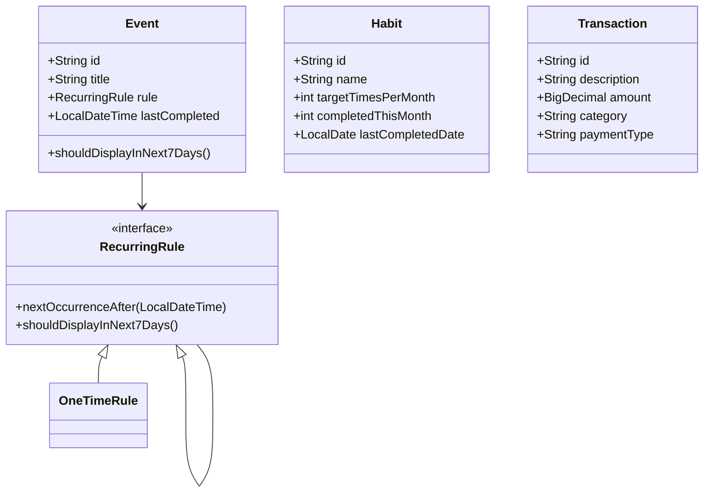

<<<<<<< HEAD
# 📋 個人管家

> 整合日程管理、記帳、待辦事項、重複事件提醒的個人生活管理系統。

## 專案簡介

**期望解決的問題：**
- 傳統 ToDo List 缺少習慣統計功能
- 容易忘記「上次什麼時候做某件事」（Last Time）
- 每月固定事項需要重複建立
- 希望有一個簡單且持久的個人生活管家

**核心功能：**
- 習慣養成追蹤 + 每月完成次數統計
- 支援循環規則（每週、隔週、每月固定日期、非固定）
- Last Time 自動記錄機制
- 簡單記帳（現金 / 信用卡分類）

**適合對象：** 需要長期管理生活習慣與事務的學生與上班族。

---

## 🏗️ 系統架構（Class Diagram）


---

## 🚀 如何啟動專案

### 1. 啟動 PostgreSQL（使用 Docker）

```Bash
docker run --name mydb -e POSTGRES_PASSWORD=postgres -e POSTGRES_DB=myproject -p 5433:5432 -d postgres:16
```

### 2.建立資料表
執行 sql/schema.sql 中的 SQL 指令（已包含初始測試資料）

### 3.執行程式

```Bash
# Windows
run.bat

# Mac / Linux
./run.sh
```

主程式入口： Main.java

---

# 📐 專案結構

```text
java-butler/
├── sql/
│   └── schema.sql                    ← 建表 + 測試資料
├── src/main/java/com/java/butler/
│   ├── Main.java
│   ├── config/
│   │   └── DatabaseConfig.java
│   ├── model/          # Event, Habit, Transaction, RecurringRule...
│   ├── dao/            # EventDAO
│   ├── service/        # 業務邏輯層
│   └── view/           # MainView（CLI 選單）
├── README.md
├── run.bat
├── run.sh
└── .gitignore
```

---

# 技術要點與亮點

- **MVC 分層架構**（Model / DAO / Service / View）
- **物件導向設計：** 抽象類別、介面、Enum、多型
- **Strategy Pattern**（循環規則引擎）
- **JDBC + PreparedStatement**（防止 SQL Injection）
- **try-with-resources** 確保資源釋放
- **Docker** 部署 PostgreSQL 資料庫

---

# CLI 操作截圖（Demo）
（請在此處插入 3 張以上截圖）

- 主選單畫面
- 新增習慣 / 查看本週待辦
- 習慣統計功能
- 記帳功能