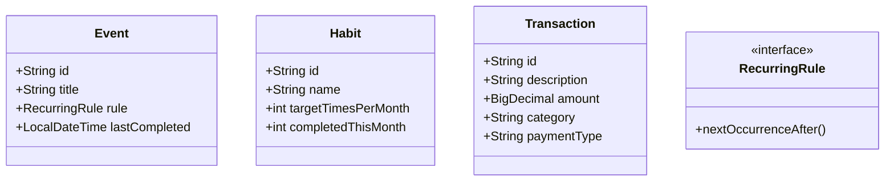

# 📋 個人管家

> 以 **Java + PostgreSQL** 開發的個人生活管理系統，幫助使用者長期追蹤習慣、日程與生活事務。

**適合對象：** 需要長期管理生活習慣與事務的學生與上班族。

## 專案簡介

本系統讓使用者可以建立各類 **任務 / 習慣**，系統會自動記錄執行日期、類別、狀態，並提供強大的 **查詢與覆盤** 功能。

---

### **核心解決問題：**
- 替你記得「上次什麼時候做某件事」
- 輕鬆統計習慣次數
- 免去固定、非固定事項在完成後需要重新建立

### **主要功能：**

1. **任務 / 習慣建立與管理**  
   使用者可建立任務，設定類別（身體、心靈、財務、家務等）、金額（記帳用）、狀態與循環規則。


2. **循環規則引擎**  
   支援多種循環方式：每日、週、月等固定週期，乃至不固定的每 X 天 / X 週 / X 月等。


3. **Last Time**  
   自動記錄每種事件（以任務命名為關鍵字）最後一次執行的時間。包括而不限於習慣養成。


4. **習慣統計與覆盤**
    - 特定期間（預設一個月，可自定義）內某項目的**累積完成次數**
    - **距離現在的間隔時間**（支援顯示：X 日 → X 月 / 年 又 X 天 → X.X 月 / 年）


5. **記帳功能**  
   記錄消費行為，並可依現金、銀行卡、自訂類別查詢該期間的金額統計。

### **技術要點：**

- **MVC 分層架構**（Model / DAO / Service / View）
- **物件導向設計：** 抽象類別、介面、Enum、多型
- **Strategy Pattern**（循環規則引擎）
- **JDBC + PreparedStatement**（防止 SQL Injection）
- **try-with-resources** 確保資源釋放

---

## 🏗️ 系統架構



## ERD（資料庫關聯圖）
缺

---

# 📐 專案結構

```text
java-butler/
├── sql/schema.sql
├── src/main/java/com/java/butler/
│   ├── model/      # Event, Habit, Transaction, RecurringRule...
│   ├── dao/        # EventDAO
│   ├── service/    # 業務邏輯
│   ├── view/       # CLI 介面
│   └── config/
├── README.md
├── run.bat
└── run.sh
```

---

## 🚀 如何啟動專案

---

### 1. 環境需求

- Java 17 或以上
- Docker（用來啟動 PostgreSQL）
- IntelliJ IDEA（推薦）

### 2. 建立資料庫

```bash
# 啟動 PostgreSQL
docker run --name mydb -e POSTGRES_PASSWORD=postgres -e POSTGRES_DB=myproject -p 5433:5432 -d postgres:16
```

### 3.建立資料表

執行專案中 sql/schema.sql 的 SQL 指令（已包含測試資料）

### 4.編譯與執行

```Bash
# Windows
run.bat

# Mac / Linux
chmod +x run.sh
./run.sh
```

主程式入口： src/main/java/com/java/butler/Main.java

---

# CLI 操作截圖（Demo）
（請在此處插入 3 張以上截圖）

- 主選單畫面
- 新增習慣 / 查看本週待辦
- 習慣統計功能
- 記帳功能